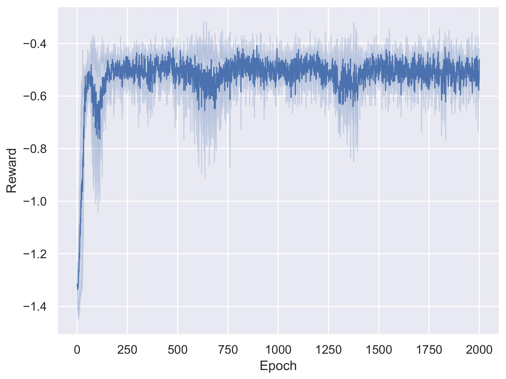
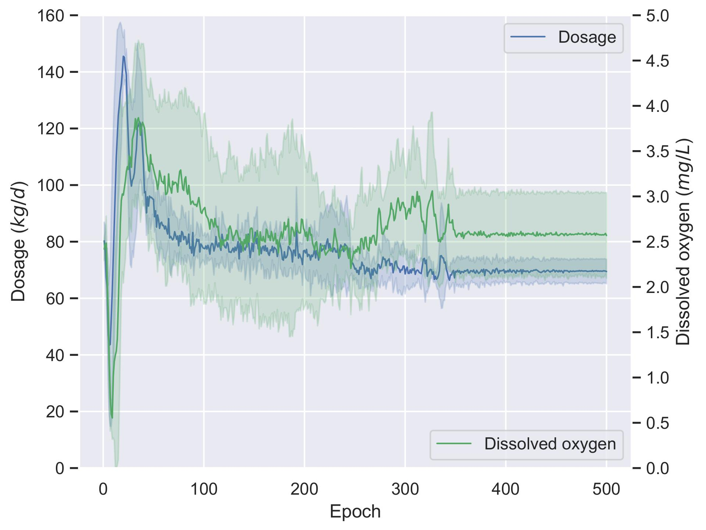

### 1. Project Introduction
The project applied reinforcement learning (RL) to achieve multi-variable optimization in wastewater treatment plants (WWTPs). Specifically, Deep Deterministic Policy Gradient (DDPG) is applied in an AAO-based WWTP to optimize dissolved oxygen (DO) and solid retention time (SRT). The reward function is specially designed as LCA-based form to achieve sustainability optimization. Four scenarios: baseline, LCA-oriented, cost-oriented and effluent-oriented are considered.

### 2. Learning
The DDPG learning process mainly follows the original paper and is introduced in this section. The algorithm is coded with Pytorch under Python 3.7 environment.
Different from the original paper, Gaussian noise $\mathcal{N}$ rather than Ornstein-Uhlenbeck process is used for exploration.
Hyperparameters of DDPG are fine tuned. Before training, $1,000$ sample points are acquired by Monte Carlo sampling, actions are sampled from uniform distribution. The environment is achieved with the RL toolkit, Gym, developed by OpenAI. The value of DO ranges from 0 to 8 $mg/L$, and wastage rate ranges from 0 to 200 $m^3/d$, i.e. SRT $\geq$ 4.5 $days$. 

### 3. Result
The result shows that optimization based on LCA has lowest environmental impacts. The cost scenario tends to lower cost but still has high GHG emissions and eutrophication potential. It is worth mentioning that the upgrading and reconstruction of WWTPs should be implemented with the consideration of other environmental impacts.

### 4. Paper
[Paper](http://www.google.com) 

